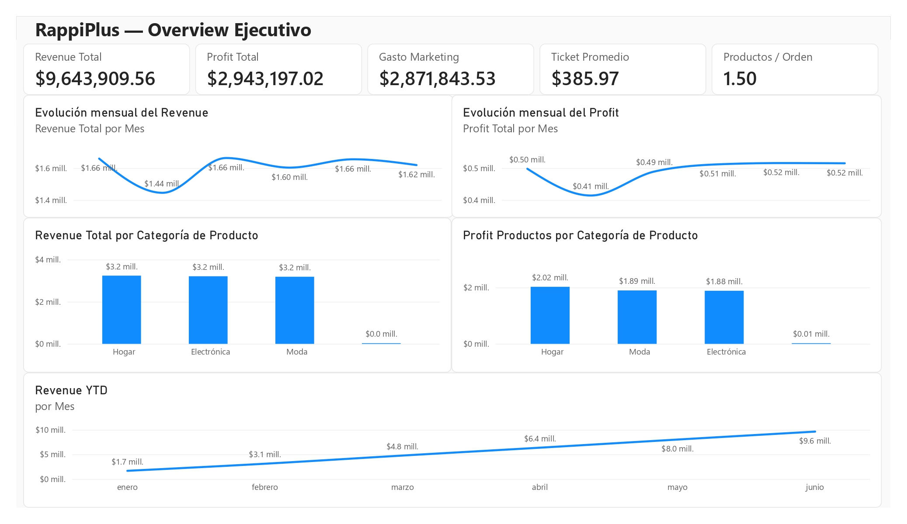
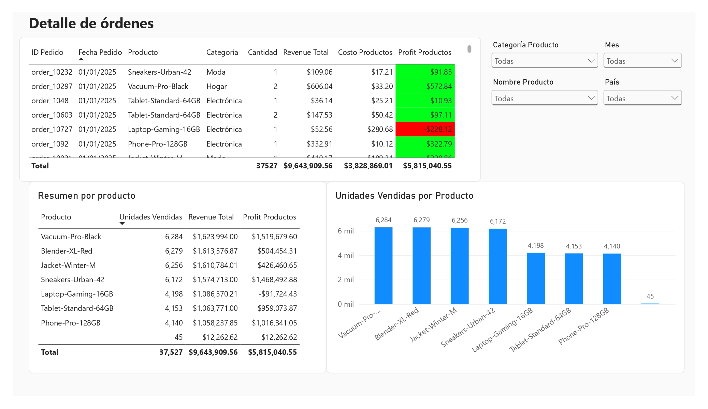
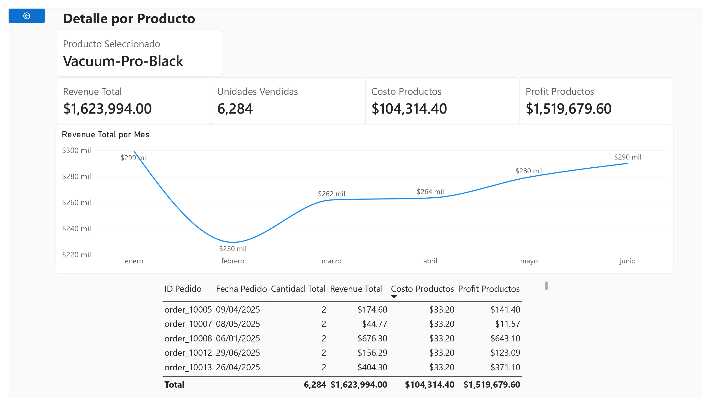

# RappiPlus Data Analytics

## From Data to Business Decisions

End-to-end business analysis of **RappiPlus**, a subscription-based service, focused on understanding sales performance, profitability, marketing investment, and customer purchasing behavior.

The project combines **Python, SQL, and Power BI** to transform raw transactional data into actionable business insights.

---

## Business Objective

The business team wanted to understand whether RappiPlus is meeting its commercial objectives and where opportunities for improvement exist throughout the purchasing process.

The analysis focuses on three main business questions:

1. **Are customers purchasing?**
2. **Is the business model profitable?**
3. **Where are there opportunities to improve the purchasing process?**

---

## Analysis Performed

The project covers:

* Data quality assessment and cleaning
* Duplicate and missing-value analysis
* Detection and treatment of anomalous values
* Data type and numerical consistency validation
* Sales and revenue analysis
* Product cost and profitability analysis
* Marketing investment analysis
* Category and product performance analysis
* Monthly performance analysis
* Product-level drill-through analysis
* Validation of analytical results between Python and Power BI

---

## Key KPIs

| KPI                        |           Result |
| -------------------------- | ---------------: |
| Total Revenue              |    $9,643,909.56 |
| Total Product Cost         |    $3,828,869.01 |
| Marketing Spend            |    $2,871,843.53 |
| Total Profit               |    $2,943,197.02 |
| Product Profit             |    $5,815,040.55 |
| Average Order Value        |          $385.97 |
| Average Products per Order |             1.50 |
| Top-Selling Product        | Vacuum-Pro-Black |
| Units Sold — Top Product   |            6,284 |

---

## Key Business Insights

### Overall Performance

RappiPlus generated approximately **$9.64M in revenue** during the analyzed period, with a total profit of approximately **$2.94M** after product costs and marketing investment.

### Product Performance

**Vacuum-Pro-Black** was the top-selling product, with **6,284 units sold**.

The three product categories generated relatively similar revenue levels, with **Home** leading slightly.

### Marketing Investment

Marketing spending totaled approximately **$2.87M**, distributed across:

* Social
* Organic
* Paid Search

This investment represents an important component of the company's overall profitability and should therefore be evaluated together with revenue and product performance.

### Monthly Performance

Revenue remained relatively stable throughout the analyzed period, while total profit showed a positive performance toward the later months.

The monthly analysis helps identify changes in commercial performance and provides a basis for monitoring future trends.

---

## Dashboard

The Power BI dashboard is organized into three main pages.

### 1. Executive Overview

Provides a high-level view of the business performance.

Includes:

* Total Revenue
* Total Profit
* Marketing Spend
* Average Order Value
* Average Products per Order
* Monthly Revenue
* Monthly Profit
* Revenue by Category
* Product Profit by Category
* Year-to-Date Revenue

### 2. Detail / Drill-through

Provides detailed transactional information and enables users to investigate product-level performance.

Includes:

* Order ID
* Order Date
* Product
* Product Category
* Quantity
* Revenue
* Product Cost
* Product Profit

Conditional formatting is used to highlight positive and negative profitability.

### 3. Product Detail

Provides a detailed analysis of an individual product selected through the drill-through functionality.

Includes:

* Selected Product
* Revenue
* Units Sold
* Product Cost
* Product Profit
* Monthly Revenue
* Related Orders

This page allows users to move from a high-level business view to the underlying transactions behind a specific product.

---

## Dashboard Preview

### Executive Overview



### Detail / Drill-through



### Product Detail


---

## Data Preparation

The datasets were cleaned and validated before the analysis and dashboard development.

Main data preparation activities included:

* Removing duplicate order records
* Standardizing country names
* Handling missing values
* Identifying invalid quantities
* Detecting anomalous numerical values
* Correcting data types
* Validating monetary calculations
* Checking consistency between calculated and reported totals
* Preparing clean datasets for Power BI

The final datasets used in the dashboard are:

* `orders_clean.csv`
* `catalog_clean.csv`
* `marketing_clean.csv`

---

## Data Validation

An important part of the project was validating the results across different stages of the analytical workflow.

Calculations were initially performed and validated using **Python/Pandas**, and the resulting KPIs were then reproduced in **Power BI** using DAX measures.

This cross-validation helped ensure consistency between the analytical notebook and the final dashboard.

---

## Dashboard Design

The dashboard was designed following a business-oriented approach:

**Executive Overview → Detailed Analysis → Product Investigation**

This structure allows stakeholders to:

1. Understand the overall business performance.
2. Identify areas that require attention.
3. Drill down into specific products and transactions.

The objective was to keep the dashboard focused on decision-making rather than simply displaying large amounts of data.

---

## Tools & Technologies

* **Python**
* **Pandas**
* **SQL**
* **Power BI**
* **DAX**
* **Jupyter Notebook**
* **Git & GitHub**

---

## Repository Structure

```text
RappiPlus-Data-Analytics/
│
├── README.md
│
├── notebooks/
│   └── RappiPlus_Analysis_Final.ipynb
│
├── data/
│   ├── orders_clean.csv
│   ├── catalog_clean.csv
│   ├── marketing_clean.csv
│   └── README.md
│
├── dashboard/
│   └── RappiPlus_Dashboard.pbix
│
└── images/
    ├── executive_overview.png
    ├── detail_drillthrough.png
    └── product_detail.png
```

---

## How to Use

### Python Analysis

Open the notebook:

```text
notebooks/RappiPlus_Analysis_Final.ipynb
```

The notebook contains the data preparation, validation, analysis, and calculations performed during the project.

### Power BI Dashboard

Open:

```text
dashboard/RappiPlus_Dashboard.pbix
```

The dashboard can be used to explore the business KPIs, analyze performance by category and product, and investigate individual products through drill-through functionality.

---

## Project Objective

This project was developed as the **final project of a Data Analytics Bootcamp**, combining technical skills with a business-oriented analytical approach.

The main objective was to demonstrate the complete analytical workflow:

**Raw Data → Data Cleaning → Analysis → Business Insights → Dashboard → Decision Support**

---

## Future Improvements

Potential future extensions include:

* Customer segmentation
* Customer lifetime value analysis
* Marketing ROI by channel
* Customer retention analysis
* More detailed purchasing funnel analysis
* Predictive sales analysis
* Automated dashboard refresh
* Advanced customer behavior analysis

---

## Author

**Braulio Santiago Esquivel**

Data Analyst | Database Administrator | Mechanical Engineer

Skills: SQL · Python · Pandas · Power BI · Tableau · Data Analysis
